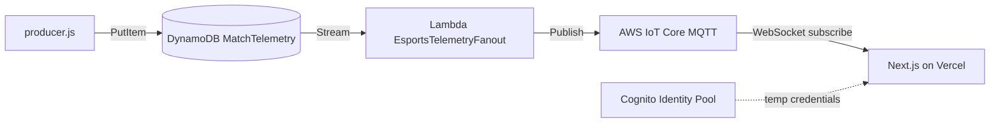

> **What this file is for:** Your **internal technical reference** for the current pipeline — what each AWS service does, how the pieces connect, how to verify them, and how to explain the architecture to hackathon judges. Keep this detailed; use `blog.md` for the public write-up and `talk.md` for the demo video script.

# Hackathon Architecture Explanation

This document explains **everything that was built** for the real-time telemetry pipeline: what each piece does, why it exists, how the pieces connect, and how you can explain it to judges.

**Live app:** https://ultimate-global-entertainment.vercel.app  
**Hackathon:** [H0: Hack the Zero Stack](https://h01.devpost.com/) — Track 3: Million-scale Global App

---

## 1. The problem we are solving

You are building a **live esports "second screen"** app. During a match:

- **Game telemetry** arrives very fast (kills, positions, objectives) — potentially every few hundred milliseconds.
- **Thousands or millions of viewers** may be watching at the same time.
- Every viewer needs to see **the same game state**, updated in near real time.

That creates two hard engineering problems:

1. **Ingestion at speed** — store high-frequency events without overwhelming a database.
2. **Broadcast at scale** — push the same update to many browsers without opening a separate connection per user to your own backend server.

The solution is a **decoupled pipeline**: write once to DynamoDB, then use managed AWS services to fan the data out to all viewers.

---

## 2. Big-picture architecture

```text
┌─────────────────┐
│  producer.js    │  Simulates live game events (every 500ms)
│  (your laptop)  │
└────────┬────────┘
         │ PutItem
         ▼
┌─────────────────┐
│   DynamoDB      │  Source of truth: MatchTelemetry table
│ MatchTelemetry  │  PK=MATCH#M-1001, SK=EVENT#<timestamp>#<uuid>
└────────┬────────┘
         │ DynamoDB Stream (change log)
         ▼
┌─────────────────┐
│     Lambda      │  EsportsTelemetryFanout
│  (serverless)   │  Reads new rows, publishes to IoT
└────────┬────────┘
         │ iot:Publish
         ▼
┌─────────────────┐
│   AWS IoT Core  │  MQTT broker — handles massive fan-out
│  topic:         │  esports/telemetry/M-1001
│  esports/...    │
└────────┬────────┘
         │ WebSocket (MQTT over WSS)
         ▼
┌─────────────────┐
│  Next.js app    │  Live Command Center dashboard
│  on Vercel      │  MQTT subscribe + map, feed, social UI
└─────────────────┘
```

### Mermaid version (for slides)



---

## 3. Project timeline — what exists today

| Piece | Status |
|---|---|
| Next.js app (`v01-uge-emiliano/`) | Deployed to Vercel |
| DynamoDB table `MatchTelemetry` | Active, TTL enabled, stream enabled |
| `telemetry_mock_data/producer.js` | Writes fake match events every 500ms |
| DynamoDB Stream → Lambda → IoT | **Live** — `EsportsTelemetryFanout` |
| Cognito Identity Pool + guest IAM role | **Live** — browser subscribe auth |
| Frontend MQTT subscriber | **Live** — `useTelemetryStream` hook |
| Command-center dashboard UI | **Live** — map, feed, stream panel, social scaffold |
| Aurora DSQL + sharded counters | **Planned** — polls/chat persistence |
| Live video embed | **Optional** — set `NEXT_PUBLIC_STREAM_EMBED_URL` |

---

## 4. What was built (full inventory)

### AWS infrastructure

| # | Action | AWS resource / file |
|---|---|---|
| 1 | Enabled DynamoDB Stream on `MatchTelemetry` | Stream with `NEW_IMAGE` view |
| 2 | Created Lambda function `EsportsTelemetryFanout` | `telemetry_fanout_lambda/index.js` |
| 3 | Created IAM role for Lambda | `EsportsTelemetryFanoutLambdaRole` |
| 4 | Connected stream → Lambda (event source mapping) | Automatic trigger on new inserts |
| 5 | Created Cognito Identity Pool for browsers | `EsportsTelemetryPool` |
| 6 | Created IAM role for unauthenticated viewers | `EsportsTelemetryCognitoUnauthRole` |
| 7 | Set Vercel env vars + local `.env.local` | 3 `NEXT_PUBLIC_*` variables |
| 8 | Redeployed Vercel production | Picks up env vars at build time |

### Frontend (dashboard + IoT subscriber)

| # | File | Purpose |
|---|---|---|
| 9 | `lib/telemetry/useTelemetryStream.ts` | Connects to IoT, subscribes, buffers events |
| 10 | `lib/telemetry/cognitoCredentialsProvider.ts` | Fetches guest creds from Cognito for browser MQTT |
| 11 | `lib/telemetry/types.ts` | Telemetry types, topic name, payload parsing |
| 12 | `components/dashboard/Dashboard.tsx` | Main layout — header, panels, stats |
| 13 | `components/dashboard/LiveStreamPanel.tsx` | Video embed slot (Twitch/IVS placeholder) |
| 14 | `components/dashboard/TelemetryMap.tsx` | Arena map — player dots from coordinates |
| 15 | `components/dashboard/TelemetryFeed.tsx` | Scrolling event log with action badges |
| 16 | `components/dashboard/SocialPanel.tsx` | Poll + chat scaffold (local state for now) |
| 17 | `components/dashboard/ConnectionBadge.tsx` | Live / Connecting / Error status indicator |

---

## 5. Core concepts explained

### 5.1 DynamoDB — the telemetry store

**What it is:** A NoSQL database optimized for very fast reads and writes at huge scale.

**How we use it:** The `producer.js` script inserts one event per write. Each row looks like:

```json
{
  "PK": "MATCH#M-1001",
  "SK": "EVENT#1782130849938#0a881912-c3a5-44a5-a93e-f9c61cf61e9c",
  "PlayerId": "Player_1",
  "Action": "Kill",
  "CoordinateX": 42.5,
  "CoordinateY": 88.1,
  "ExpiryTimestamp": 1782217249
}
```

- **PK (partition key):** groups all events for one match (`MATCH#M-1001`).
- **SK (sort key):** makes each event unique and orderable by time.
- **ExpiryTimestamp + TTL:** DynamoDB auto-deletes rows after 24 hours so the table stays small.

**Why DynamoDB for telemetry:** It handles bursty, high-frequency writes without you managing servers. It is the **source of truth** — even if the live broadcast fails, the data is still stored and can be replayed.

---

### 5.2 DynamoDB Streams — the change log

**What it is:** An ordered log of every change to the table (inserts, updates, deletes).

**What we configured:**
- **Stream enabled:** `true`
- **View type:** `NEW_IMAGE` — each stream record contains the full new row after an insert

**Why we need it:** The producer only talks to DynamoDB. Something else must notice "a new row arrived" and push it live. The stream is that notification mechanism. Lambda subscribes to the stream and runs automatically.

**Analogy:** DynamoDB is a ledger. The stream is a live ticker that says "new line just written."

---

### 5.3 AWS Lambda — the bridge function

**What it is:** Serverless compute. You upload a small function; AWS runs it only when triggered. You pay per invocation, not for an always-on server.

**Our function:** `EsportsTelemetryFanout`

**What it does (step by step):**

1. DynamoDB Stream delivers a batch of change records to Lambda.
2. Lambda loops through each record.
3. If the event is an `INSERT` (new telemetry row), it reads the row.
4. It extracts the match ID from `PK` (`MATCH#M-1001` → `M-1001`).
5. It publishes the full row as JSON to IoT Core on topic `esports/telemetry/M-1001`.

**The actual code** (`telemetry_fanout_lambda/index.js`):

```javascript
// For each new DynamoDB row...
const item = unmarshall(record.dynamodb.NewImage);
const matchId = item.PK.replace("MATCH#", "");

// Publish to IoT MQTT topic
await iot.send(new PublishCommand({
  topic: `esports/telemetry/${matchId}`,
  payload: Buffer.from(JSON.stringify(item)),
  qos: 0,
}));
```

**Why Lambda instead of the producer publishing directly?**

- The producer stays simple: write to DynamoDB only.
- DynamoDB remains the audit trail.
- You can add more consumers later (analytics, replay, alerts) without changing the producer.
- Separation of concerns: ingestion vs. distribution.

**IAM role:** Lambda cannot call AWS services by default. It needs an IAM role (`EsportsTelemetryFanoutLambdaRole`) with permission to:
- Read from the DynamoDB stream
- Publish to IoT topics
- Write logs to CloudWatch

---

### 5.4 AWS IoT Core — and what "fan-out" means

**What IoT Core is:** A managed **MQTT message broker**. MQTT is a lightweight pub/sub protocol designed for devices and real-time messaging.

**Publish / Subscribe model:**
- A **publisher** sends a message to a **topic** (like a channel name).
- **Subscribers** who are listening on that topic receive the message.
- One publish can reach **thousands of subscribers** — that is **fan-out**.

**Fan-out** = one message in, many recipients out.

```text
Lambda publishes 1 message
        │
        ▼
   IoT Core topic: esports/telemetry/M-1001
        │
   ┌────┼────┬────┬────┐
   ▼    ▼    ▼    ▼    ▼
Viewer Viewer Viewer Viewer ... (millions possible)
```

**Why IoT Core instead of API Gateway WebSocket?**

Your original plan used API Gateway WebSocket. That works, but for **one-to-many broadcast** (everyone gets the same data), you would need Lambda to loop over every connected client and send individually. At million-scale, that is expensive and slow.

IoT Core is built for pub/sub fan-out natively. Lambda publishes **once**; IoT Core handles delivery to all subscribers.

**Your IoT endpoint:** `a32dwjh9raxrc2-ats.iot.us-east-2.amazonaws.com`

This hostname is unique to your AWS account and region. Browsers connect to it over **WebSocket Secure (WSS)** using the MQTT protocol.

**How we got the endpoint:** AWS CLI command:

```bash
aws iot describe-endpoint --endpoint-type iot:Data-ATS --region us-east-2
```

You already had this value in `.env.local` from earlier setup.

---

### 5.5 Amazon Cognito Identity Pool — and what the ID means

This is often the most confusing piece. Here is the full story.

#### The security problem

Browsers cannot safely hold your AWS access keys. Anything in frontend JavaScript is visible to users. So how does a web page connect to IoT Core?

**Answer:** The browser gets **temporary, limited credentials** from Cognito.

#### What Cognito Identity Pool is

A **Cognito Identity Pool** (also called "federated identities") issues short-lived AWS credentials to:
- Logged-in users (authenticated), or
- Anonymous visitors (unauthenticated / guest)

For a public live dashboard, we use **unauthenticated (guest) access** so anyone can watch without signing up.

#### What the Identity Pool ID is

It is simply the **unique name AWS assigned** when we created the pool:

```
us-east-2:f3103c6f-8bb7-4da7-919d-41f7176a0a89
```

Breaking it down:
- `us-east-2` — AWS region
- `f3103c6f-8bb7-4da7-919d-41f7176a0a89` — UUID for this specific pool

**It is not a secret.** It is a public identifier, like a Google Maps API key prefix. Security comes from the **IAM policy** attached to the guest role, which only allows subscribe/receive on telemetry topics — not publish, not access to your whole AWS account.

#### How we created it

```bash
aws cognito-identity create-identity-pool \
  --identity-pool-name EsportsTelemetryPool \
  --allow-unauthenticated-identities \
  --region us-east-2
```

AWS returned the `IdentityPoolId` in the response. That is the value we put in:
- `v01-uge-emiliano/.env.local`
- Vercel environment variables as `NEXT_PUBLIC_COGNITO_IDENTITY_POOL_ID`

#### The guest IAM role

Cognito alone does not grant IoT permissions. We also created:

- **Role:** `EsportsTelemetryCognitoUnauthRole`
- **Trust policy:** only Cognito Identity Pool can assume this role, and only for unauthenticated users from *our* pool.
- **Permissions policy:** allows `iot:Connect`, `iot:Subscribe`, `iot:Receive` on `esports/telemetry/*` — **not** `iot:Publish`.

```text
Browser loads Next.js page
    │
    ▼
SDK calls Cognito with Identity Pool ID
    │
    ▼
Cognito returns temporary AWS credentials (access key, secret, session token)
    │  (valid ~1 hour, scoped to guest role)
    ▼
SDK uses those credentials to open WSS connection to IoT Core
    │
    ▼
Browser subscribes to esports/telemetry/M-1001
```

#### Why `NEXT_PUBLIC_` prefix?

In Next.js, only environment variables prefixed with `NEXT_PUBLIC_` are exposed to browser JavaScript. The Cognito pool ID and IoT endpoint are safe to expose. **Never** put IAM access keys in `NEXT_PUBLIC_` variables.

---

### 5.6 Next.js dashboard — the browser subscriber

**What it is:** A client-side React dashboard deployed on Vercel that subscribes to IoT Core and renders live telemetry.

**Entry point:** `app/page.tsx` renders `<Dashboard />`.

**Connection flow** (`lib/telemetry/useTelemetryStream.ts`):

1. On mount, dynamically imports `aws-iot-device-sdk-v2/dist/browser` (browser-only — not SSR).
2. `CognitoCredentialsProvider` calls Cognito `GetId` + `GetCredentialsForIdentity`.
3. IoT MQTT config is built with `AwsIotMqttConnectionConfigBuilder.new_builder_for_websocket()`.
4. `MqttClient` connects and subscribes to `esports/telemetry/M-1001`.
5. Each message is parsed and pushed into a rolling buffer (last 80 events).

**UI panels:**

| Panel | Component | Data source |
|---|---|---|
| Live stream | `LiveStreamPanel` | Optional iframe via `NEXT_PUBLIC_STREAM_EMBED_URL` |
| Arena map | `TelemetryMap` | Latest `CoordinateX/Y` per player |
| Event feed | `TelemetryFeed` | Buffered IoT events, newest first |
| Social sidecar | `SocialPanel` | Local React state (Aurora DSQL later) |
| Connection status | `ConnectionBadge` | Hook `status` + `error` |

**npm packages added:**

- `aws-iot-device-sdk-v2` — MQTT over WebSocket to IoT Core
- `@aws-sdk/client-cognito-identity` — guest credentials for the browser

**Next.js config note:** `serverExternalPackages: ['aws-iot-device-sdk-v2', 'aws-crt']` in `next.config.ts` — the SDK uses native/browser-specific builds that must not be bundled for SSR.

---

## 6. Step-by-step: what was executed in AWS

### Step A — Enable DynamoDB Stream

```bash
aws dynamodb update-table \
  --table-name MatchTelemetry \
  --stream-specification StreamEnabled=true,StreamViewType=NEW_IMAGE \
  --region us-east-2
```

**Result:** Stream ARN:
`arn:aws:dynamodb:us-east-2:581351185959:table/MatchTelemetry/stream/2026-06-22T12:13:52.713`

---

### Step B — Create Lambda IAM role

Created role `EsportsTelemetryFanoutLambdaRole` with:
- **Trust policy** — allows `lambda.amazonaws.com` to assume the role
- **Inline policy** — stream read + IoT publish + CloudWatch logs

Policy files saved in repo: `infrastructure/iam/`

---

### Step C — Package and deploy Lambda

1. Wrote handler in `telemetry_fanout_lambda/index.js`
2. Installed AWS SDK dependencies (`@aws-sdk/client-iot-data-plane`, `@aws-sdk/util-dynamodb`)
3. Zipped `index.js` + `node_modules/` → `telemetry_fanout_lambda.zip`
4. Created function via AWS CLI:

```bash
aws lambda create-function \
  --function-name EsportsTelemetryFanout \
  --runtime nodejs20.x \
  --role arn:aws:iam::581351185959:role/EsportsTelemetryFanoutLambdaRole \
  --handler index.handler \
  --zip-file fileb://telemetry_fanout_lambda.zip \
  --environment "Variables={IOT_ENDPOINT=a32dwjh9raxrc2-ats.iot.us-east-2.amazonaws.com}" \
  --region us-east-2
```

`IOT_ENDPOINT` is a Lambda environment variable so the code knows which IoT broker to publish to.

---

### Step D — Wire stream to Lambda

```bash
aws lambda create-event-source-mapping \
  --function-name EsportsTelemetryFanout \
  --event-source-arn <stream-arn> \
  --starting-position LATEST \
  --batch-size 10 \
  --bisect-batch-on-function-error
```

- **`LATEST`:** only process new events from now on (not historical backlog).
- **`batch-size 10`:** up to 10 stream records per Lambda invocation.
- **`bisect-batch-on-function-error`:** if one bad record fails, split the batch and retry — avoids losing the whole batch.

---

### Step E — Cognito + guest role for browsers

1. Created identity pool `EsportsTelemetryPool`
2. Created `EsportsTelemetryCognitoUnauthRole` with IoT subscribe permissions
3. Linked pool → role via `aws cognito-identity set-identity-pool-roles`

---

### Step F — Vercel environment variables

Added to the Vercel project `ultimate-global-entertainment`:

| Variable | Purpose |
|---|---|
| `NEXT_PUBLIC_AWS_IOT_ENDPOINT` | Where browsers connect for MQTT |
| `NEXT_PUBLIC_AWS_REGION` | AWS region for credential requests |
| `NEXT_PUBLIC_COGNITO_IDENTITY_POOL_ID` | Which identity pool issues browser credentials |

Then ran `vercel --prod` to redeploy so the build includes these values.

---

## 7. Files added or changed in the repository

### New files

| File | Purpose |
|---|---|
| `telemetry_fanout_lambda/index.js` | Lambda handler source code |
| `telemetry_fanout_lambda/package.json` | Lambda dependencies |
| `infrastructure/iam/lambda-trust-policy.json` | Lambda can be assumed by AWS Lambda service |
| `infrastructure/iam/lambda-telemetry-fanout-policy.json` | Lambda permissions (stream + IoT + logs) |
| `infrastructure/iam/cognito-unauth-trust-policy.json` | Cognito guest users can assume unauth role |
| `infrastructure/iam/cognito-unauth-iot-policy.json` | Guest role can subscribe to telemetry topics |
| `infrastructure/deploy-lambda.sh` | Script to redeploy Lambda after code changes |

### New files (frontend)

| File | Purpose |
|---|---|
| `v01-uge-emiliano/lib/telemetry/useTelemetryStream.ts` | IoT subscribe hook |
| `v01-uge-emiliano/lib/telemetry/cognitoCredentialsProvider.ts` | Browser Cognito credentials |
| `v01-uge-emiliano/lib/telemetry/types.ts` | Shared telemetry types |
| `v01-uge-emiliano/components/dashboard/*.tsx` | Dashboard UI components |
| `v01-uge-emiliano/app/page.tsx` | Renders dashboard (replaced Next.js starter) |

### Changed files

| File | Change |
|---|---|
| `.gitignore` | Ignore `telemetry_fanout_lambda.zip` (build artifact, 3MB) |
| `v01-uge-emiliano/.env.local` | All `NEXT_PUBLIC_*` variables (not committed) |
| `v01-uge-emiliano/package.json` | IoT SDK + Cognito client dependencies |
| `v01-uge-emiliano/next.config.ts` | `serverExternalPackages` for IoT SDK |
| `v01-uge-emiliano/app/globals.css` | Dark esports theme |

### Not committed (by design)

| Item | Why |
|---|---|
| `telemetry_fanout_lambda.zip` | Generated deployment package |
| `telemetry_fanout_lambda/node_modules/` | Installed locally for packaging |
| `.env.local` | Local secrets / config |
| `.vercel/` | Vercel link metadata |

### AWS resources (live in cloud, not in repo)

These exist only in your AWS account `581351185959`, region `us-east-2`:

- DynamoDB table `MatchTelemetry` (+ stream)
- Lambda `EsportsTelemetryFanout`
- IAM roles (2)
- Cognito Identity Pool `EsportsTelemetryPool`
- Event source mapping (stream → Lambda)

---

## 8. How to verify the pipeline works

### Test 1 — Producer writes to DynamoDB

```bash
cd telemetry_mock_data
node producer.js
```

Expected: console logs every 500ms, e.g. `[timestamp] Inserted event for Player_3`

### Test 2 — Lambda processes stream

```bash
aws logs tail /aws/lambda/EsportsTelemetryFanout --region us-east-2 --follow
```

Expected: `START` / `END` / `REPORT` lines every few seconds, no `ERROR`.

### Test 3 — IoT receives messages (AWS Console)

1. Open **AWS Console → IoT Core → MQTT test client**
2. Subscribe to topic: `esports/telemetry/M-1001`
3. Run producer
4. JSON events should appear in the test client

### Test 4 — Vercel env vars

```bash
cd v01-uge-emiliano
vercel env ls
```

Expected: 3 variables for Production and Development.

### Test 5 — End-to-end dashboard

1. Run producer (`node producer.js`)
2. Open https://ultimate-global-entertainment.vercel.app
3. Connection badge shows **Live** (green)
4. Event feed scrolls; arena map shows player dots
5. Kill / Objective counters increment

---

## 9. What is NOT done yet

| Item | Status |
|---|---|
| Aurora DSQL + sharded counters | Not started — social poll/chat uses local UI state |
| Live video embed URL | Optional — set `NEXT_PUBLIC_STREAM_EMBED_URL` on Vercel |
| Real viewer chat backend | Placeholder messages in `SocialPanel` |
| Vercel Edge-cached API routes for match metadata | Planned (`s-maxage=1, stale-while-revalidate`) |
| Preview env vars on Vercel | Production + Development set; Preview may need manual setup |

The **telemetry pipeline is end-to-end complete**: producer → DynamoDB → Lambda → IoT → browser dashboard.

---

## 10. How to explain this to hackathon judges (30-second pitch)

> "We ingest high-frequency esports telemetry into DynamoDB as our source of truth. A DynamoDB Stream triggers a Lambda function that publishes each new event to AWS IoT Core over MQTT. IoT Core handles fan-out to millions of viewers natively — one publish reaches everyone subscribed to the match topic. A Next.js command-center dashboard on Vercel subscribes over WebSocket, using Cognito guest credentials so we never expose AWS keys. Polls and chat will layer on Aurora DSQL with sharded counters next. This decouples fast writes from global real-time distribution — built for the million-scale track."

---

## 11. Glossary

| Term | Meaning |
|---|---|
| **Fan-out** | One message delivered to many recipients |
| **MQTT** | Lightweight pub/sub messaging protocol |
| **Topic** | Named channel, e.g. `esports/telemetry/M-1001` |
| **Publish** | Send a message to a topic |
| **Subscribe** | Listen for messages on a topic |
| **DynamoDB Stream** | Change log emitted by DynamoDB on every table write |
| **Lambda** | Serverless function that runs on triggers |
| **IAM Role** | Set of permissions assumed by a service or user |
| **Cognito Identity Pool** | Issues temporary AWS credentials to web/mobile clients |
| **Identity Pool ID** | Public identifier for your Cognito pool (`region:uuid`) |
| **WSS** | WebSocket Secure — how browsers connect to IoT Core |
| **TTL** | Time-to-live; DynamoDB auto-deletes expired rows |
| **OCC** | Optimistic Concurrency Control (relevant later for Aurora DSQL social state) |
| **Sharded Counter** | Pattern to avoid many writers hitting one row (future polls/leaderboards) |

---

## 12. Resource reference card

Keep this handy during demos:

```
AWS Account:     581351185959
Region:          us-east-2

DynamoDB:        MatchTelemetry
Stream view:     NEW_IMAGE

Lambda:          EsportsTelemetryFanout
Lambda role:     EsportsTelemetryFanoutLambdaRole

IoT endpoint:    a32dwjh9raxrc2-ats.iot.us-east-2.amazonaws.com
IoT topic:       esports/telemetry/M-1001

Cognito pool:    EsportsTelemetryPool
Pool ID:         us-east-2:f3103c6f-8bb7-4da7-919d-41f7176a0a89
Guest role:      EsportsTelemetryCognitoUnauthRole

Vercel URL:      https://ultimate-global-entertainment.vercel.app
Vercel project:  ultimate-global-entertainment
```

---

## 13. Common questions you might get

**Q: Why not have the producer publish directly to IoT?**  
A: DynamoDB would not be the source of truth. You would lose audit/replay capability and mix ingestion with distribution.

**Q: Is the Cognito Pool ID secret?**  
A: No. It is a public identifier. Security is enforced by the IAM policy on the guest role (subscribe-only, specific topics).

**Q: What if Lambda fails?**  
A: Events are still in DynamoDB. You can replay from the table. Stream + bisect-on-error retries failed batches.

**Q: Why QoS 0 for MQTT publish?**  
A: Lowest latency. For live telemetry where the next event arrives in 500ms, losing one message is acceptable. Use QoS 1 if you need guaranteed delivery.

**Q: How does this scale to millions?**  
A: DynamoDB handles write throughput. Lambda scales automatically. IoT Core is designed for massive concurrent MQTT connections and fan-out. Vercel serves the frontend at the edge.

**Q: Where does v0 fit in?**  
A: The dashboard layout follows the v0-style dense command-center pattern (stream + telemetry + social panels). Components were implemented in Next.js with Tailwind to match the hackathon stack requirements.

---

## 14. Related docs in this repo

| File | Use when |
|---|---|
| `blog.md` | Publishing to Medium, LinkedIn, or dev.to (#H0Hackathon bonus) |
| `talk.md` | Recording the <3 min Devpost demo video |
| `explanation.md` | This file — deep technical reference and judge prep |
| `REALTIME_TELEMETRY_SETUP.md` | Original IoT + Lambda setup notes |
| `SETUP_NEW_MACHINE.md` | Cloning the repo on a new laptop |

---

*Last updated: June 22, 2026 — reflects full pipeline including frontend dashboard and IoT subscriber.*
